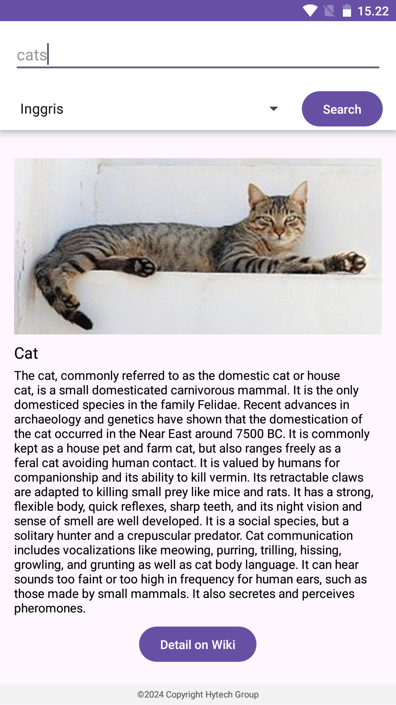

# Wiki Searching Kotlin

  Simple Kotlin application for searching data on a wiki. SDK 34 In Android Studio

 
 
## Instalation
- Clone Repositories
```
git clone https://github.com/fitri-hy/wiki-search-kotlin.git
```
- Import Project in Android Studio
- Run / Build Project

## Supported Grandle
```
compileSdk = 34
minSdk = 24
targetSdk = 34
```

Support me by giving stars. Hope it is useful.
